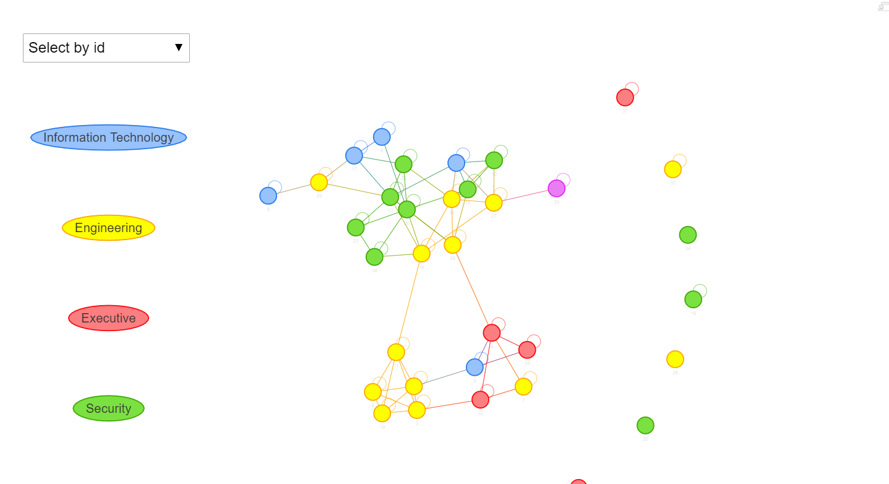

# Vast Challenge 2021: Mini-Challenge 2

# Background
Many of the Abila, Kronos-based employees of GAStech have company cars which are approved for both personal and business use. Those who do not have company cars have the ability to check out company trucks for business use, but these trucks cannot be used for personal business.

Employees with company cars are happy to have these vehicles, because the company cars are generally much higher quality than the cars they would be able to afford otherwise. However, GAStech does not trust their employees. Without the employees? knowledge, GAStech has installed geospatial tracking software in the company vehicles. The vehicles are tracked periodically as long as they are moving.

This vehicle tracking data has been made available to law enforcement to support their investigation. Unfortunately, data is not available for the day the GAStech employees went missing. Data is only available for the two weeks prior to the disappearance.

To promote local businesses, Kronos based companies provide a Kronos Kares benefit card to GASTech employees giving them discounts and rewards in exchange for collecting information about their credit card purchases and preferences as recorded on loyalty cards. This data has been made available to investigators in the hopes that it can help resolve the situation. However, Kronos Kares does not collect personal information beyond purchases.

As a visual analytics expert assisting law enforcement, your mission is to identify which GASTech employees made which purchases and identify suspicious patterns of behavior. You must cope with uncertainties that result from missing, conflicting, and imperfect data to make recommendations for further investigation.


# Questions
1.	Using just the credit and loyalty card data, identify the most popular locations, and when they are popular. What anomalies do you see? What corrections would you recommend to correct these anomalies? Please limit your answer to 8 images and 300 words.

2.	Add the vehicle data to your analysis of the credit and loyalty card data. How does your assessment of the anomalies in question 1 change based on this new data? What discrepancies between vehicle, credit, and loyalty card data do you find? Please limit your answer to 8 images and 500 words.

3.	Can you infer the owners of each credit card and loyalty card? What is your evidence? Where are there uncertainties in your method? Where are there uncertainties in the data? Please limit your answer to 8 images and 500 words.

4.	Given the data sources provided, identify potential informal or unofficial relationships among GASTech personnel. Provide evidence for these relationships. Please limit your response to 8 images and 500 words.

5.	Do you see evidence of suspicious activity? Identify 1- 10 locations where you believe the suspicious activity is occurring, and why Please limit your response to 10 images and 500 words.


#Scope of work

To address the questions above, below is the required scope of work
1. Literature Review
2. Data preparation
3. Methodology and visualisation
4. Answers
5. Acknowledgment


# 1. Literature Review

This year Vast Challenge uses the same question based on 2014 Vast Challenge. As such, we will conduct literature review on past 2014 Vast Challenge submission based on MC2 – Patterns of Life Analysis. We will select some of the past submission to identify some of the gaps that can potentially utilized interactive data visualization techniques to improve user experiences. The repository for 2014 Vast Challenge – MC2: Patterns of Life Analysis submissions can be found  [here](http://visualdata.wustl.edu/varepository/VAST%20Challenge%202014/challenges/MC2%20-%20Patterns%20of%20Life%20Analysis/)


### 1.1 University of Buenos Aries - Arcaya.

The localization of different people based on bar chart is difficult to visualize as there are too many people with indicated by different type of colours and there are too many locations thereby squeezing the bar chart altogether. A recommendation is to split 
location up into 3-4 groups so that it will be easier to visualize.


### 1.2 Shandong University

The price vs consumption area by using density plot is not a very good idea as it is very confusing to know which employee is which as there are too many employees squeeze into one chart. There is no legend or tooltip to indicate the employees.


### 1.3. ASTRI

The bar chart used to indicate less frequented location is too squeezy especially those portion with many departments squeeze into one location. These makes it difficult for people to analyse. A recommendation is to group the data into lesser locations and possibly provided some interactivity where user can click the legend to select the department they want.


# 2. Data preparation

### 2.1 Customisation of code chunks

First, we will customize the all code chunks using the below knitr code. More information on chunk options can be found [here](https://yihui.org/knitr/options/#animation)
```{r setup, include=FALSE}
options(htmltools.dir.version = FALSE)
knitr::opts_chunk$set(echo = TRUE,
                      eval = TRUE,
                      fig.retina = 3,
                      message = FALSE,
                      warning = FALSE)
```

### 2.2 Installing required R packages

Next, we will install the required R packages. There are three basic groups of packages that we will install,

1) For data manipulation and preparation
The [*tidyverse*](https://www.tidyverse.org/) package is a group of R packages including [*dplyr*](https://dplyr.tidyverse.org/), [*tidyr*](https://tidyr.tidyverse.org/) that assist user to manipulate data.

2) Date and Time
The two packages [*clock*](https://clock.r-lib.org/) and  [*lubridate*](https://lubridate.tidyverse.org/) are used for the manipulation of date and time data

3) Interactive data analysis
The two packages [*ggiraph*](https://cran.rstudio.com/web/packages/ggiraph/ggiraph.pdf) and [*plotly*](https://plotly.com/r/) are used to output data into interactive graphical/chart form for analysis.

4) GeoVisual Analysis
The packages [*raster*](https://cran.r-project.org/web/packages/raster/raster.pdf), [*sf*](https://r-spatial.github.io/sf/),[*tmap*](https://cran.r-project.org/web/packages/tmap/vignettes/tmap-getstarted.html) and [*rgdal*](https://cran.r-project.org/web/packages/rgdal/index.html) are used for geospatial visual analytics where data are output to a map for analysis such as movement of people etc.

5) Network Analysis
Lastly, to analyse the relationship between people etc. We will use the packages from [*tidygraph*](https://www.data-imaginist.com/2017/introducing-tidygraph/), [*igraph*](https://igraph.org/), [*ggraph*](https://www.data-imaginist.com/2017/ggraph-introduction-layouts/) and [*visNetwork*](https://datastorm-open.github.io/visNetwork/#:~:text=visNetwork%20is%20an%20R%20package,%2Fdatastorm%2Dopen%2FvisNetwork.). *visNetwork* is a package to output interactive network analysis. 

```{r}
packages = c('DT','ggiraph','plotly','tidyverse', 'raster','sf','clock','tmap',
             'rgdal','dplyr', 'tidyr', 'textclean', "plotly", "forcats", "jpeg", "tiff",
             "mapview","tidygraph","igraph","ggraph","visNetwork","lubridate")
for(p in packages){
  if(!require(p,character.only = T)){
    install.packages(p)
  }
  library(p,character.only = T)
}
```

### 2.3 Provided data and information
There are 3 different types of data & information provided. A *geospatial dataset*, *csv files* and a *jpg file* consisting of the Abila tourist map.

Below is the information of all the data provided.

### 2.3.1. A csv file on vehicle assignments to employee (car-assignments.csv)

1) Employee Last Name

2) Employee First Name

3) Car ID (integer)

4) Current Employment Type (Department; categorical)

5) Current Employment Title (job title; categorical)

### 2.3.2.	A CSV file of vehicle tracking data (gps.csv)

3.1	Timestamp

3.2	Car ID (integer)

3.3	Latitude

3.4	Longitude

### 2.3.3.	A CSV file containing loyalty card transaction data (loyalty_data.csv)

4.1	Timestamp

4.2	Location (name of the business)

4.3	Price (real)

4.4	Loyalty Number (A 5-character code starting with L that is unique for each card)


### 2.3.4.	A CSV file containing credit and debit card transaction data (cc_data.csv)

5.1	Timestamp

5.2	Location (name of the business)

5.3	Price (real)

5.4	Last 4 digits of the credit or debit card number

### 2.3.5.	ESRI shapefiles of Abila (in the Geospatial folder)

### 2.3.6.	A tourist map of Abila with locations of interest identified, in JPEG format (MC2-Tourist.jpg)


### 2.4. Importing of data

We will import the 4 different *csv* datasets that were provided


```{r}
car <- read_csv("data/mc2/car-assignments.csv")
cc <- read_csv("data/mc2/cc_data.csv")
gps <- read_csv("data/mc2/gps.csv")
loyalty <- read_csv("data/mc2/loyalty_data.csv")
```

If we take a look at the above datasets in excel, we will see that there are foreign characters in some of the datasets provided. An example is the Katerina's Cafe as shown below. To address this, we will need to encode the dataset to allow rstudio to read properly. 


To allow use to know the encoding type for both cc and loyalty dataset. Guess encoding will be used to detect the encoding type as shown below..


```{r}
guess_encoding(cc)
guess_encoding(loyalty)
```

Next, we will add the code locale = locale(encoding = "ASCII" on both cc and loyalty dataset)


```{r}
car <- read_csv("data/mc2/car-assignments.csv")
cc <- read_csv("data/mc2/cc_data.csv", locale = locale(encoding = "ASCII"))
gps <- read_csv("data/mc2/gps.csv")
loyalty <- read_csv("data/mc2/loyalty_data.csv",locale = locale(encoding = "ASCII"))
```

### 2.5. Data examination

First, we will look at both cc and loyalty card dataset by using the *glimpse* function as shown below. There are 1490 rows and 1392 rows in both the cc and loyatly dataset respectfully. If we take look closely, we will see that these two datasets are closely linked by location, price and timestamp except the last4ccnum and loyaltynum are different. 

If we take a look back at the MC2 background, we will observe that Kronos based companies are allowed to collect credit card and loyalty cards information on GAStech employees purchases as such these two datasets are similar in nature. 

However, the rows for both cc and loyalty card data are different. This anomaly might have a few reasoning, 1) the employees did not used their credit cards while doing purchases but loyalty card was presented. 2) Vice versa, employees might also used their credit card but did not present their loyalty card during purchases.


```{r}
glimpse(cc)
glimpse(loyalty)
```

Next, we will look at the vehicle datasets. The 44 rows car datasets are represented by the employee, employment information with their car assignment ID.

The gps datasets are based on the car movements in respect to their lat and long position with timestamp.


```{r}
glimpse(car)
glimpse(gps)

```

### 2.6. Data Preparation

### 2.6.1 CC and Loyalty dataset

We will prepare the cc and loyalty datasets for data exploration later.

### 2.6.1.1. Changing the datatypes of last4ccnum & loyaltynum

The last4ccnum of the cc datasets and the loyaltynum of the loyalty dataset should be a categorical data type. As such, we will change it by using the *as.factor* function. 


```{r}
cc$last4ccnum <- as.factor(cc$last4ccnum)
loyalty$loyaltynum <- as.factor(loyalty$loyaltynum)
```

Next, we will modify the datatype for both the timestamp of cc and loyalty dataset using the *clock* package. If we observe below, the data_time_parse function is use to change the timestamp to *dttm* (datetime) format while the date_parse function is used to change the data to *date* format.


```{r}
cc$timestamp <- date_time_parse(cc$timestamp,
                                 zone = "",
                                 format = "%m/%d/%Y %H:%M")

loyalty$timestamp <- date_parse(loyalty$timestamp,
                                 format = "%m/%d/%Y")

```


We will double check the dataset to confirm that the datatype has been changed to the one we wanted.


```{r}
glimpse(cc)
glimpse(loyalty)

```

### 2.6.1.2 Splitting the timestamp data into individual date, time and day columns.

To allow us to dive deeper into our analysis later, we will split the timestamp dataset into date, time and day columns. We will first add more columns by using the *mutate* function from dplyr to add day, date and time columns in the cc dataset and importing in to the *cc_dtsplit* object.

There is no need to add columns for the loyatly dataset as we will join both the datasets together in which day will be included in the joined dataset.

```{r}
cc_dtsplit <- cc %>%
  mutate(day = date_weekday_factor(cc$timestamp), date =  as_date(cc$timestamp), time = format(cc$timestamp, format = "%H:%M"))

cc_dtsplit

```

To allow us to join both datasets together, we will need to rename the timestamp column from the loyatly dataset to *date* so that both the date columns have the same name.


```{r}
loyalty_dt <- rename(loyalty, date = timestamp)

```

We will take a look at our newly cleaned datasets to double check the changed we have made previously.


```{r}
glimpse(cc_dtsplit)
glimpse(loyalty_dt)

```

### 2.6.1.3. Changing the datatypes of car & gps

First, we will take a look at the car & gps datasets. Notice that the CarID and id for both datasets are not of the correct categorical datatype. We will proceed to change both the two columns.


```{r}
glimpse(car)
glimpse(gps)

```
Changing of CarID and ID to categorical data.


```{r}
car$CarID = as.factor(car$CarID)
gps$id = as.factor(gps$id)

```

### 2.6.1.4. Combining both first and last name.
 
Next, we will combine both first and last name of the car datasets into one column for us to analyse the person easily. We will use the *tidyr* function unite to unify both the first and last name into *name*.


```{r}
car_unite <- car %>%
  unite(col = "name", LastName,FirstName, sep = ", ",  remove =FALSE) 

```


### 2.6.1.5. Change datatype of time and rename id to Carid

Next, we will rename the id of gps to CarID to match with the car_unite data. Additionally, the Timestamp data of gps will be changed to the dttm format


```{r}
gps_cleaned <- rename(gps,CarID = id)

gps_cleaned$Timestamp <- date_time_parse(gps_cleaned$Timestamp,
                                 zone = "",
                                 format = "%m/%d/%Y %H:%M")

```

Lastly, we will look at our cleaned dataset and we have done cleaning the data.


```{r}
glimpse(car_unite)
glimpse(gps_cleaned)

```

# 3. Methodology and Visualisation methods

Below we will discuss some methodology and visualization methods used to answer the questions later.

### 3.1. Bar Chart

First, we will be using a bar chart to analyse the number of patrons to each location. A bar chart is very useful to analyse categorical data based on number of instances.

The code uses both tidyverse and plotly packages to create the bar chart. First, a count was used to count each location by visits. Then a mutate function was used  to create and sort the location by count in descending order. Next, a plotly bar chart was created by indicating the x and y axis with additional layout for the chart. 

The plotly bar chart is accessible later in the question segment.


### 3.2. Line chart

To visualize timeseries data, a time-series line chart is great for analysis. 

The below line chart uses the top few most visited places to plot into a timeseries line.


### 3.3. Geospatial visualization

Next, a geospatial map visualisation is created to analyse the movement of each vehicle.


### 3.4. Network analysis

An interactive network data analysis is created to visualise the realtionship between each person.

Notice that the carid can be selected to see its relationship between other carid. Those that are nearest and highlighted are carid that have a close relationship with the person of interest.




